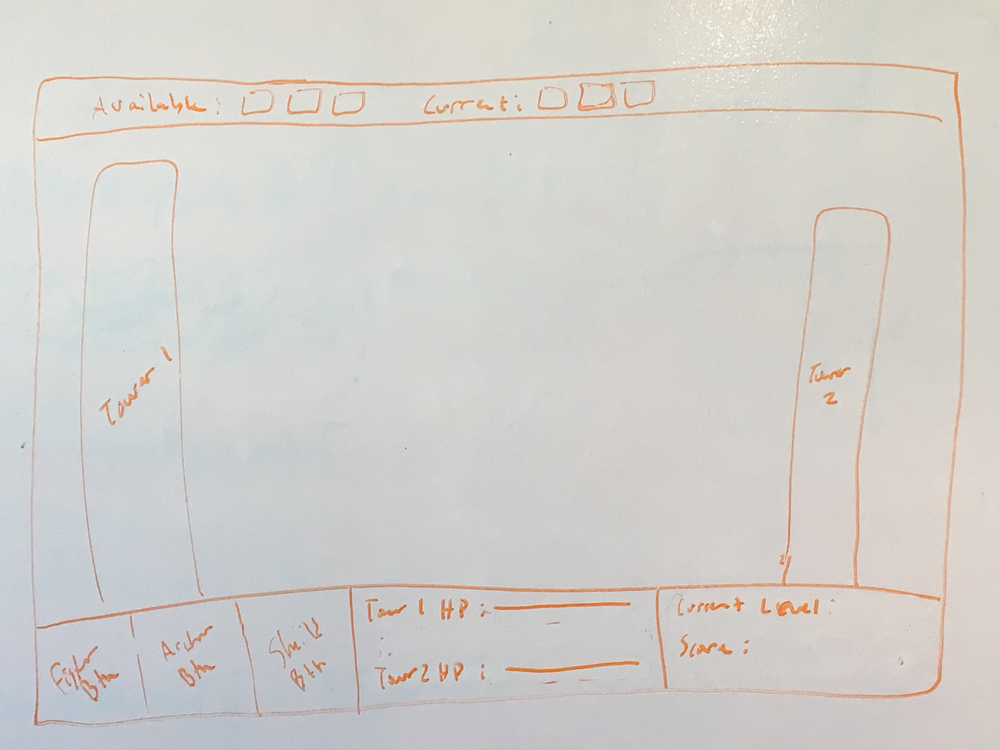

# Project #1: Tower Battle

## User Stories:

* I. player starts game and the level begins
 *   A. when player clicks a button it will run various functions
  *      a. instantiates a unit of the selected type 
   *     b. starts a "cooldown" on the button clicked which will not allow you to click the button again
    *        i. will add the unit picture to the current units and remove from available units.
     *   c. starts functions that will begin moving the unit towards the enemy tower.
      *      i. collision function to tell when the unit has come within range of another unit or the tower.
       *     ii. they will begin to attack each other based on objects stats doing damage to enemy HP based on attack power.
        *    iii. check to see if either the unit or the tower has been destroyed
         *           x. if the unit is destroyed then continue moving
          *          z. if tower is destroyed ends level and begins a new level with AI "unit objects" increased stats and cooldowns
II.  the AI player will wait a couple seconds and produce a unit
    A. AI will pick a random unit and send it towards player
        a. Instantiates a unit of the randomly selected type
        b.Use the same functions to compute the battle as player 1

## Some properties for the Objects
### Unit class:
HP
attack damage
attack speed
move speed
various images and gifs
alive or dead toggle
name
Extensions for each different unit type
methods for attacking
methods for dying

### Game Object:
array for current units
array for available units
toggle variable to check if the game is active
collision prevention array or variable? (this may have to be in the Units class)
method to control the level
velocity registration variables?

### MVP: 
the player should be able to build up to three unique units, upon being built they will clash with the computers units until the player can destroy all the computers units and 
its tower.  Then progress to the next level.

### Post MVP:
add a currency mechanic and make it so you have to buy the units
be able to upgrade the units and tower changing their stats and sprites
show damage dealt above each unit
show health bars above each unit
be able to toggle health bars and damage dealt shown over each unit
add in some sort of boss battle after you destroy each tower
weather function that will change the weather and affect all the units in different ways
add a victory screen that shows stats for each level and a button that you can press to move to next level or quit
make it possible to build a "hero" who will gain experience and as he levels increase stats
add different abilities to the hero
add a skill tree so player can choose which abilities he wants to.
make my own sprites for it.
